# PEC Tracking Online Portal

## Repository Structure

```
├── frontend/          → Web application (Vite + React)
│   └── src/
│       ├── landing/   → Public marketing page
│       ├── login/     → Role-based login portal
│       ├── student/   → Student dashboard
│       ├── parent/    → Parent dashboard
│       ├── faculty/   → Faculty dashboard
│       └── shared/    → Common components, hooks, styles & store
├── backend/           → Spring Boot microservices (Maven multi-module)
│   ├── api-gateway/
│   ├── discovery-server/
│   ├── student-general-profile-service/
│   └── pom.xml
├── docs/              → Project documentation & design files
├── infrastructure/    → Docker Compose, IaC configs
└── README.md
```

## Architecture

```mermaid
architecture-beta
    group frontend(cloud)[Frontend Infrastructure]
    group backend(cloud)[Microservices]
    group cicd(cloud)[CICD]

    service user(logos:wmr)[User]
    service r53(logos:aws-route53)[Route 53]

    service s3(logos:aws-s3)[S3 Bucket] in frontend
    service cf(logos:aws-cloudfront)[CloudFront] in frontend

    service apigw(logos:aws-api-gateway)[API Gateway] in backend
    service ecr(logos:aws-ecs)[ECR] in backend
    service eks(logos:aws-eks)[EKS] in backend

    service gh(logos:github-icon)[GitHub] in cicd
    service jenkins(logos:jenkins)[Jenkins] in cicd

    user:R -- L:r53

    r53:R -- L:cf
    cf:R -- L:s3

    r53:B -- T:apigw
    apigw:R -- L:eks 
    eks:R <-- L:ecr

    gh:L --> R:jenkins
    jenkins:L --> R:s3
    jenkins:B --> R:ecr
```



## Tech Stack

### Frontend
- **Framework**: React 19
- **Build Tool**: Vite
- **Language**: TypeScript
- **Styling**: Tailwind CSS
- **UI Components**: Shadcn UI
- **State Management**: Redux Toolkit + RTK Query
- **Routing**: React Router
- **Testing**: Vitest, React Testing Library

### Backend
- **Framework**: Spring Boot 3
- **Language**: Java 21
- **Build Tool**: Maven
- **Database**: PostgreSQL
- **Containerization**: Docker
- **Orchestration**: Kubernetes (EKS)
- **API Gateway**: Spring Cloud Gateway
- **Service Discovery**: Spring Cloud Netflix Eureka
- **Testing**: Spring Boot Test, Testcontainers

### Infrastructure
- **Cloud Provider**: AWS
- **Container Registry**: Amazon ECR
- **Compute**: Amazon EKS (Elastic Kubernetes Service)
- **Storage**: Amazon S3
- **CDN**: Amazon CloudFront
- **DNS**: Amazon Route 53
- **CI/CD**: Jenkins
