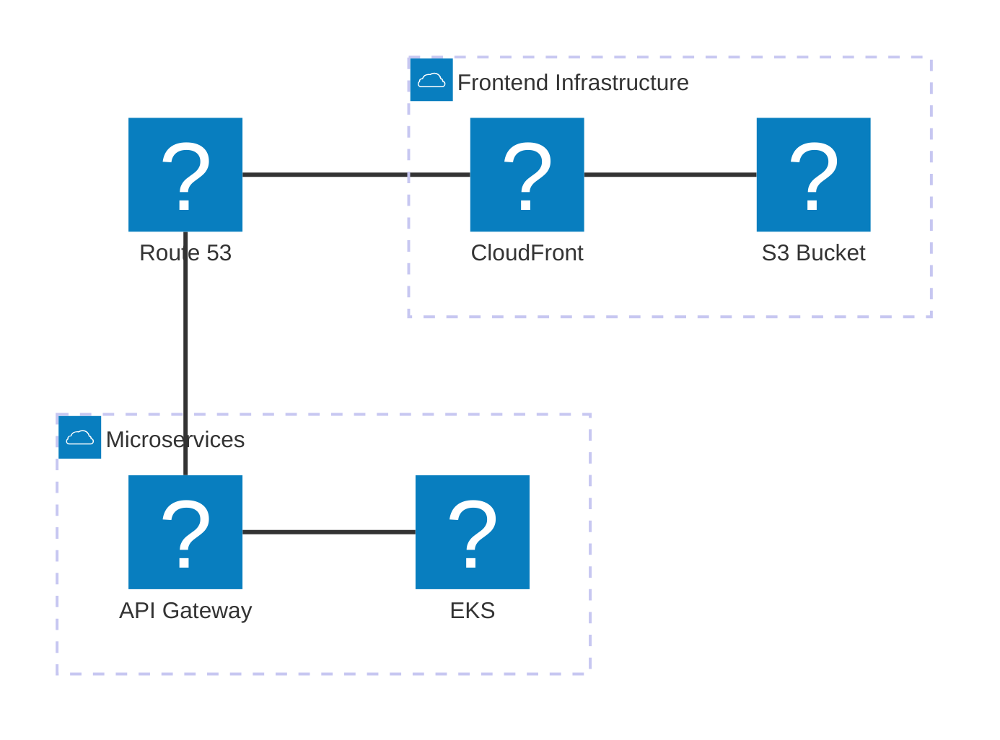

# PEC Tracking Online Portal

## Architecture

```mermaid
architecture-beta
    group frontend(cloud)[Frontend Infrastructure]
    group backend(cloud)[Microservices]

    service r53(logos:aws-route53)[Route 53]

    service s3(logos:aws-s3)[S3 Bucket] in frontend
    service cf(logos:aws-cloudfront)[CloudFront] in frontend

    service apigw(logos:aws-api-gateway)[API Gateway] in backend
    service eks(logos:aws-eks)[EKS] in backend

    r53:R -- L:cf
    cf:R -- L:s3

    r53:B -- T:apigw
    apigw:R -- L:eks
```