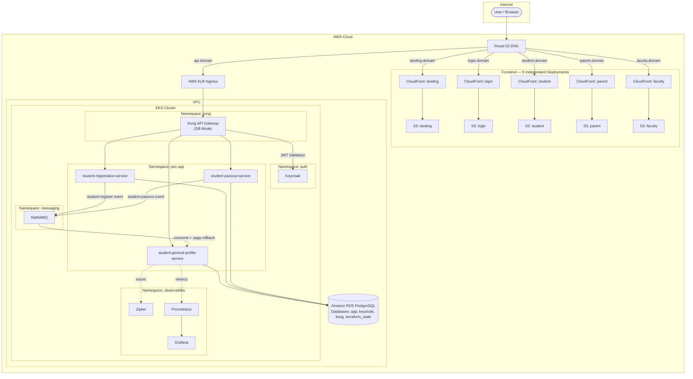

# Software Requirements Specification

## PECTOP (PEC Tracking Online Portal)

### 1. Introduction

### 1.1 Purpose

The purpose of this document is to provide a detailed description of the requirements for the **PECTOP (PEC Tracking Online Portal)**. This application is designed to digitize the existing paper-based student mentoring booklet, creating a centralized and efficient system for tracking and managing student mentorship, academic performance, and personal development throughout their time at the institution.

### 1.2 Intended Audience

This document is intended for all stakeholders involved in the development and implementation of the application, including:

- Project Managers
- Software Developers
- UI/UX Designers
- Quality Assurance Team
- College Administration (HODs, Principal)
- Faculty Members (Mentors, Class Coordinators)

### 1.3 Overall Description

The PECTOP will be a web-based platform that allows for the easy entry, storage, and retrieval of student data currently captured in the physical mentoring booklet. It will provide different levels of access for various user roles, ensuring data privacy and integrity. The system aims to improve the efficiency of the mentoring process, provide better insights into student performance through analytics, and enhance communication between mentors, students, and parents.

### 1.4 Scope

The scope of this project is to develop a comprehensive application that covers all aspects of the mentoring booklet. This includes:

- **One-Time Data Entry:** Student personal, family, and general academic profile information.
- **Per-Semester Data Entry:** Academic performance, mentoring sessions, and activity charts for each semester.
- **End-of-Program Data:** Placement details and final student status.
- Reporting and data analysis features.

The initial phase will focus on replicating the functionality of the booklet, with future phases potentially including features like automated notifications, advanced analytics dashboards, and integration with other college systems.

### 2. Overall Description

### 2.1 Product Perspective

This application will be a standalone system, but it is designed with the potential for future integration with the college's existing Student Information System (SIS). It will replace the manual, paper-based process, reducing paperwork and the risk of data loss.

### 2.2 Product Functions

The key functions of PECTOP are:

- **User Authentication and Authorization:** Secure login for different user roles.
- **Student Profile Management:** Create, view, and update student profiles. This is divided into a one-time general profile and recurring semester-based profiles.
- **Mentor-Mentee Management:** Allow administrators to assign students to specific mentors.
- **Academic Tracking:** Input and monitor semester-wise results, attendance, and arrears.
- **Mentoring Session Logging:** Record details and ratings of each mentoring session on a per-semester basis.
- **Reporting:** Generate comprehensive reports on student progress and mentor activities.
- **Offline Access:** Provide core functionality when the user's device is offline.

### 2.3 User Classes and Characteristics

| **User Role** | **Responsibilities & Permissions** | **Technical Expertise** |
| --- | --- | --- |
| **Administrator** | Manages user accounts, system settings, and has full access to all data. Can assign students to mentors and generate institution-level reports. | High |
| **Head of Department (HOD)** | Can view all student data within their department. Can view mentor activities and generate departmental reports. | Medium |
| **Mentor / Faculty** | Can view a list of their assigned mentees. Can view and update data for their assigned mentees. Can log mentoring sessions and input academic data. | Basic |
| **Student** | Can view their own profile and academic data (read-only access). | Basic |
| **Parent/Guardian** | Can view their child's profile and academic data (read-only access). | Basic |

### 2.4 Operating Environment

The application will be a web-based platform accessible through modern web browsers (e.g., Chrome, Firefox, Safari, Edge). The technology stack is as follows:

- **Frontend:** The frontend is a **multi-app React.js PWA** built with **Vite**, **Tailwind CSS**, and the **Shadcn/ui** component library. It is split into **5 independently deployed applications**, each targeting a specific user role:
  - `landing` — Public-facing marketing/info page (port 3000 in dev)
  - `login` — Shared authentication/login entry point (port 3001)
  - `student` — Student portal (port 3002)
  - `parent` — Parent/Guardian portal (port 3003)
  - `faculty` — Faculty/Mentor/Admin portal (port 3004)
  Each app is built independently via `VITE_APP=<app> vite build`, producing a standalone `dist/<app>/index.html` that is deployed to its **own S3 bucket + CloudFront distribution**, served on its own domain.
- **Backend:** Spring Boot (Java), deployed as independent **microservices** on **Amazon EKS (Elastic Kubernetes Service)**. Key backend services include:
  - `student-general-profile-service` — manages pre-college student data and basic student details (PDF pages 2–4).
  - `student-registration-service` — orchestrates student registration as a Saga.
  - `student-passout-service` — orchestrates end-of-program (passout) workflows as a Saga.
- **API Gateway:** **Kong** (DB mode, running on EKS) replaces Spring Cloud Gateway in production. Kong handles routing, JWT validation, ACL-based RBAC, rate limiting, and CORS.
- **Authentication & Authorization:** **Keycloak** (deployed via Helm on EKS), managing user realms with roles: `student`, `faculty`, `parent`, `principal`, `hod`, `admin`.
- **Messaging:** **RabbitMQ** (deployed via Helm on EKS), used for event-driven Saga-based student lifecycle orchestration (async flows). Synchronous inter-service calls use **Kubernetes-native service discovery** (CoreDNS) with **Resilience4j** circuit breakers.
- **Database:** **Amazon RDS PostgreSQL** (managed, HA). A single RDS instance hosts multiple databases: `app`, `keycloak`, `kong`, and `terraform_state`.
- **Containerization:** Services are containerized using **Google Jib** (Maven plugin), which builds OCI-compliant images and pushes directly to **Amazon ECR** without requiring a Docker daemon.
- **Hosting:** The 5 frontend apps are each hosted on a dedicated **AWS S3** bucket and distributed via a dedicated **AWS CloudFront** distribution. DNS for all 5 sub-domains is managed by **AWS Route 53**. API traffic is routed via an **AWS ALB Ingress** to the Kong gateway on EKS.
- **Observability:** **Zipkin** (distributed tracing), **Prometheus** (metrics collection), and **Grafana** (dashboards) are deployed in the `observability` namespace on EKS.
- **Infrastructure as Code (IaC):** All AWS infrastructure is provisioned and managed using **Terraform** with environment-specific configurations (`dev`, `staging`, `prod`). Kubernetes workloads are managed with **Helm** charts and **Helmfile**. Terraform state is stored in the RDS PostgreSQL instance using the `pg` backend.
- **CI/CD:** A **Jenkins** pipeline (triggered by GitHub webhooks) handles building images with Jib, pushing to ECR, running Terraform plans, and deploying to EKS via Helm.

### 2.5 Design and Implementation Constraints

- The application must be responsive and provide a seamless user experience across different devices.
- The system must adhere to data privacy regulations to protect sensitive student information.
- The user interface should be intuitive and require minimal training for faculty and staff.
- The application must support offline functionality. Data entered offline must be synchronized with the server once a network connection is re-established.
- **Microservices Constraint:** Backend services must be stateless and independently deployable. Each service owns its own data. Inter-service communication follows two patterns:
  - **Asynchronous (Saga/event-driven):** via **RabbitMQ** for operations requiring distributed coordination (e.g., student registration, passout).
  - **Synchronous (direct service-to-service):** via **Kubernetes-native service discovery** (CoreDNS) for direct REST calls between services within the cluster, protected by **Resilience4j** circuit breakers and retry policies to prevent cascading failures.
- **Frontend App Isolation:** Each of the 5 frontend apps (`landing`, `login`, `student`, `parent`, `faculty`) is independently built and deployed to its own S3 + CloudFront stack. Inter-app navigation is handled via environment-configured URLs (`VITE_*_URL`).
- **Containerization Constraint:** All backend services must be containerized as OCI images via Jib and pushed to Amazon ECR. No hand-written Dockerfiles are required.
- **Service Discovery:** On Kubernetes (EKS), Kubernetes-native DNS (CoreDNS) is used for service discovery. Eureka/Spring Cloud discovery is disabled in the `k8s` Spring profile and is retained only for local development.
- **Infrastructure Reproducibility:** All AWS infrastructure changes must be managed through Terraform. Direct console changes to production infrastructure are not permitted.
- **Budget Optimization:** AWS Graviton (ARM) instances (`t4g` family) must be used where supported to take advantage of the AWS Free Tier and cost savings. A single RDS instance with multiple databases is preferred over multiple RDS instances.

### 3. System Features

### 3.1 User and Profile Management

- **3.1.1 User Accounts:**
    - The system shall allow administrators to create, edit, and deactivate user accounts for non-student roles (e.g., HOD, Mentor).
    - When an initial student profile is created, the system shall automatically generate a corresponding student user account with the register number as the username and a secure, temporary password.
    - The system shall require students to change their temporary password upon first login.
- **3.1.2 Student Onboarding (Corresponds to PDF Pages 1-3):**
    - The system shall allow authorized users (Admin, HOD, Mentor) to create an initial student profile with only the name and register number.
    - The system shall require the student to log in to complete their core profile, including personal data, parent details, sibling details, and past educational history (10th/12th).
    - The system shall allow for the uploading of photos for the student, father, and mother.
- **3.1.3 Student General Profile (Corresponds to PDF Page 4):**
    - After onboarding, the system shall allow the student or mentor to fill out the general profile section, which includes long-term ambition, career options, SWOT analysis, and living style. This data is intended to be filled out once at the start of the academic program.

### 3.2 Per-Semester Activities

- **3.2.1 Semester Mentoring Activity (Corresponds to PDF Page 5):**
    - For each semester, the system shall allow the mentor to create a new "Semester Mentoring Activity" record.
    - This record shall capture details such as the student's field of interest, favorite/hardest subjects, library usage, and communication skills for that specific semester.
- **3.2.2 Mentoring Chart Logging (Corresponds to PDF Page 6):**
    - For each semester, the system shall provide an interface for mentors to fill out the detailed Mentoring Chart, capturing time management, faculty ratings on class routines, and the student's approach to examinations.
- **3.2.3 Academic Performance Tracking (Corresponds to PDF Page 7):**
    - For each semester, the system shall allow mentors to record subject-wise performance, including marks from a dynamic number of internal assessments and final exams.
    - The system shall track attendance percentage and the number of arrears for the semester.
- **3.2.4 Mentoring Session Logging (Corresponds to PDF Page 7):**
    - Throughout each semester, the system shall allow mentors to log multiple individual mentoring sessions, including the date and the 10-point rating scale evaluation.
- **3.2.5 Semester Review (Corresponds to PDF Page 8):**
    - At the end of each semester, the system shall allow the mentor to provide an overall review, summarizing the student's strengths, weaknesses, and any disciplinary issues for that semester.

### 3.3 End-of-Program Management (Corresponds to PDF Page 9)

- **3.3.1 Projects & Placements:**
    - The system shall allow for the tracking of mini-projects and final projects throughout the student's academic career.
    - The system shall provide a dedicated section to record placement details, including company, date, and outcome.
- **3.3.2 Final Data Summary:**
    - The system shall provide a summary view that
    consolidates semester-wise data (CGPA, attendance, etc.) into a single report, as seen on page 9 of the PDF.
    - The system shall allow for updating the student's contact address at the time of leaving the college.

### 3.4 Other Functional Requirements

- **3.4.1 Mentor-Mentee Management:** The system shall allow administrators to assign and unassign students to mentors.
- **3.4.2 Program and Branch Management:**
    - The system shall allow administrators to create, read, update, and delete academic Programs (e.g., B.E., M.B.A.).
    - The system shall allow administrators to create, read, update, and delete academic Branches (e.g., Computer Science Engineering) and associate them with a Program.
- **3.4.3 Offline Functionality:** The system shall cache essential data and allow offline entry for mentoring sessions and academic data, with synchronization upon reconnection.

### 4. External Interface Requirements

### 4.1 User Interfaces

The application will feature a clean, modern, and intuitive graphical user interface (GUI). Key UI elements will include:
- The UI will incorporate the college's branding, using the primary color `#a61612` (from the college logo) for key interactive elements to ensure a consistent and familiar look and feel.
- A centralized dashboard for each user role providing a quick overview of relevant information (e.g., list of mentees for a mentor, departmental stats for an HOD).
- User-friendly forms for data entry with clear labels, placeholders, and real-time validation to minimize errors.
- Interactive and responsive tables for displaying lists of students and academic data, with robust sorting, filtering, and search capabilities.
- A dedicated and comprehensive profile page for each student, presenting all information in a well-organized and easily digestible manner, separated by general and semester-specific data.
- **4.1.1 Responsive Table Behavior (Card-Based Transformation)**
    - To ensure optimal usability on all devices, particularly mobile, all data tables within the application will adopt a responsive transformation.
    - **On Large Screens (Desktops/Tablets):** Tables will render in their standard columnar format.
    - **On Small Screens (Mobile):** Each row of the table will transform into a `Card` component. Inside each card, the data from the columns will be displayed vertically, with clear `Labels` for each data point (e.g., "Register Number:", "Program:"). Action buttons or menus (like "View Profile" or "Edit") will be given prominence, often rendered as a full-width button at the bottom of the card for easy tapping. This approach avoids horizontal scrolling and presents information in a digestible, mobile-friendly format.

### 4.2 Hardware Interfaces

As a web-based application, the system will not interface directly with any specific hardware. It will be accessible through any standard device (desktop, laptop, tablet, smartphone) with a modern web browser.

### 4.3 Software Interfaces

- **Frontend-Backend Communication:** The React.js frontend communicates exclusively with the **Kong API Gateway** via HTTPS RESTful APIs. Kong handles request routing, JWT validation, and ACL enforcement before proxying to the appropriate backend microservice.
- **Authentication Interface:** All authentication flows use **Keycloak** as the Identity Provider. Kong's OIDC/JWT plugin validates tokens against Keycloak's JWKS endpoint. The frontend initiates the OAuth2/OIDC login flow against the Keycloak realm (`pec-portal`).
- **API Gateway (Kong) RBAC:** Kong enforces route-level, method-level access control via its ACL plugin. Keycloak roles (`student`, `faculty`, `parent`, `principal`, `hod`, `admin`) are embedded in JWTs and verified per-route.

  | Route | Method | Auth | Allowed Roles |
  |---|---|---|---|
  | `/api/student/general-profile/**` | GET | JWT + ACL | student, faculty, principal, hod |
  | `/api/student/general-profile/**` | PUT | JWT + ACL | faculty |
  | `/api/student/register` | POST | JWT + ACL | faculty, admin |
  | `/api/student/passout` | POST | JWT + ACL | faculty, admin, principal |
  | `/health`, `/actuator/health` | GET | None | Public |
  | `/api/public/**` | GET | None | Public |

- **Inter-Service Messaging (RabbitMQ):** Asynchronous, event-driven communication between microservices uses **RabbitMQ**. `student-registration-service` and `student-passout-service` act as Saga orchestrators, publishing events that participating services consume and acknowledge.
- **Database Interface:** Each backend microservice interfaces with its schema in **Amazon RDS PostgreSQL** using JDBC with Spring Data JPA. Connection pooling (HikariCP) is used to manage database connections effectively.
- **Observability Interfaces:**
  - Services emit distributed traces to **Zipkin** via the Micrometer Brave bridge.
  - Services expose a `/actuator/prometheus` endpoint that **Prometheus** scrapes for metrics.
  - **Grafana** connects to Prometheus as a data source and provides dashboards (Kong, JVM, RabbitMQ).
- **Container Registry:** Built images are pushed to **Amazon ECR** by Jib during the Jenkins build phase.
- **Future Integrations:** The system is designed with the potential for future API-based integration with the college's Student Information System (SIS) for data synchronization (e.g., syncing student data from existing systems like NetKampus).

### 4.4 Communications Interfaces

- All communication between the client (web browser) and the servers is encrypted using **HTTPS (TLS)**, terminated at the AWS ALB (for API) or AWS CloudFront (for frontend) using **ACM certificates**.
- The 5 frontend applications are served from 5 separate CloudFront distributions, each mapped to its own sub-domain. Cross-app redirects (e.g., from `landing` to `login`, or `login` to `faculty`) use absolute URLs configured via `VITE_*_URL` environment variables at build time.
- All inter-service communication within the EKS cluster (service-to-service) uses plain HTTP over the Kubernetes cluster network, as TLS termination is handled at the cluster boundary (ALB → Kong).

### 5. Non-Functional Requirements

### 5.1 Performance

- **Response Time:** All pages and API responses should load within 3 seconds under normal network conditions.
- **Concurrency:** The system must be able to handle concurrent access from at least 100 users without significant degradation in performance.
- **Data Processing:** Reports and data exports should be generated within 10 seconds for typical data sets.

### 5.2 Security

- **Authentication & Authorization:** The system enforces strict role-based access control (RBAC) via **Keycloak** as the Identity Provider and **Kong's ACL plugin** at the API Gateway layer. Users can only access data and perform actions permitted by their Keycloak-assigned role (`student`, `faculty`, `parent`, `principal`, `hod`, `admin`).
- **Token Validation:** Kong validates JWT tokens on every incoming API request against Keycloak's JWKS endpoint. Expired or invalid tokens are rejected at the gateway, before reaching any microservice.
- **Data Encryption:** All data transmission is encrypted using **HTTPS (TLS)**, terminated at the AWS ALB with **ACM certificates**. Data at rest in Amazon RDS PostgreSQL is encrypted using AWS-managed keys.
- **Secrets Management:** Application secrets (database passwords, RabbitMQ credentials, etc.) are stored in **AWS Secrets Manager** and synced into Kubernetes secrets via the **External Secrets Operator**. No static credentials are embedded in code or container images.
- **Pod-Level IAM (IRSA):** AWS IAM roles for S3 access are assigned at the pod level using **IAM Roles for Service Accounts (IRSA)**, eliminating the need for static IAM credentials.
- **Network Policies:** Kubernetes Network Policies restrict pod-to-pod traffic, ensuring services can only communicate with explicitly authorized peers.
- **Container Image Scanning:** Amazon ECR is configured to scan images on push. The Jenkins pipeline is configured to fail on detection of critical CVEs.
- **Vulnerability Protection:** The application is protected against common web vulnerabilities including SQL Injection, XSS, and CSRF, with additional protection provided by Kong's request-transformation and CORS plugins.

### 5.3 Reliability

- **Availability:** The application should have a target uptime of 99.5%, excluding scheduled maintenance.
- **Data Integrity:** The system must ensure that data is not corrupted or lost. Transactional integrity must be maintained for all database operations.
- **Backup and Recovery:** Regular, automated backups of the database must be performed to prevent data loss, with a clear recovery plan in place.

### 5.4 Usability

- **Learnability:** The user interface should be intuitive and easy to learn for users with basic computer skills, requiring minimal training.
- **Consistency:** A consistent design language, layout, and navigation should be used throughout the application to avoid user confusion.
- **Error Handling:** The system shall provide clear, user-friendly error messages and guidance on how to resolve issues.
- **Theme Support:** The application shall support both light and dark themes, allowing users to switch between them based on their preference.

### 5.5 Scalability

- **Architectural Design:** The microservices architecture deployed on EKS is designed to handle a gradual increase in the number of students, mentors, and data volume over multiple academic years.
    - **Stateless Microservices:** All Spring Boot backend services are stateless, enabling horizontal scaling. Multiple replicas of each service can run simultaneously behind Kong/ALB.
    - **Kubernetes Horizontal Pod Autoscaler (HPA):** In production, each microservice deployment is configured with HPA to automatically scale the number of pod replicas based on CPU/memory usage.
    - **Node Autoscaling:** The EKS node group supports cluster autoscaling. In production, minimum 2 nodes of `t4g.small` are used, with autoscaling to add nodes on demand.
    - **Database Scaling:** Amazon RDS PostgreSQL is configured with efficient indexing strategies. HikariCP connection pooling manages database connections. The RDS instance can be scaled vertically (instance type upgrade) with minimal downtime.
    - **Asynchronous Processing:** Long-running tasks (e.g., large report generation, student registration across services) are handled asynchronously via the RabbitMQ event bus, preventing blocking of user requests.
    - **CDN for Frontend:** The React PWA is served via AWS CloudFront, which independently scales to handle traffic spikes for the static frontend without impacting backend services.

  | Aspect | Dev | Staging | Prod |
  |---|---|---|---|
  | EKS Nodes | 2× `t4g.micro` | 2× `t4g.micro` | 2× `t4g.small` + autoscaling |
  | RDS | `db.t4g.micro`, single-AZ | `db.t4g.micro`, single-AZ | `db.t4g.micro`, single-AZ |
  | Replicas per service | 1 | 1 | 2+ with HPA |

### 5.6 Maintainability

- **Code Quality and Principles:** The source code must be well-documented, clean, and follow industry best practices and design principles to facilitate future updates and maintenance.
    - **Backend (Spring Boot):** The code adheres to SOLID principles and a clear separation of concerns (Controller → Service → Repository layers). Services are independently deployable and versioned.
    - **Frontend (React):** The code follows a component-based architecture using Shadcn/ui, with Zod for form validation and a clear state management strategy.
    - **Modularity:** Each microservice is independently maintainable. Changes to one service do not require redeployment of others, reducing blast radius.
    - **CI/CD Pipeline (Jenkins):** A Jenkins pipeline (triggered by GitHub webhooks) automates the full build-deploy lifecycle:
      1. **Build Phase:** `mvn compile jib:build` builds OCI images and pushes directly to ECR via Jib (no Docker daemon required).
      2. **Infrastructure Phase:** `terraform plan` / `terraform apply` (with approval gate) provisions or updates AWS resources.
      3. **Deploy Phase:** `helm upgrade --install` performs rolling updates on EKS pods.
    - **Infrastructure as Code:** All infrastructure is defined in Terraform (7 reusable modules: `vpc`, `eks`, `rds`, `ecr`, `s3-cloudfront`, `route53`, `iam`) with environment-specific roots (`dev`, `staging`, `prod`). Terraform state is locked using the PostgreSQL backend on RDS.
    - **Kubernetes Workloads (Helm):** All Kubernetes workloads are managed declaratively via Helm charts. Helmfile provides a single entry point for multi-chart deployments. Environment-specific values are separated into `values-dev.yaml`, `values-staging.yaml`, and `values-prod.yaml`.
    - **Observability for Maintainability:** Grafana dashboards (Kong, JVM, RabbitMQ), Zipkin traces, and Prometheus metrics provide full visibility into system health, enabling rapid diagnosis and resolution of production issues.
    - **Rollback:** Helm's built-in revision tracking enables one-command rollback to any previous deployment revision via `infrastructure/scripts/rollback.sh`.

### 5.7 Offline Support

- **Data Caching:** The PWA must cache essential application data and previously viewed student profiles on the user's device to allow for offline viewing.
- **Data Synchronization:** Data entered or modified offline must be queued locally and synced reliably with the server once a network connection is available. The user should be notified of the sync status.

### 5.8 Installability

- The application must be a PWA and should prompt users to install it on their home screen on supported devices (desktop, tablet, and mobile) for easy, app-like access. This includes providing appropriate icons and splash screen configurations in the PWA manifest for a native application feel across all platforms.

### 6. UI Description

Please refer to the `ui_descriptions.md` document for a detailed, page-by-page breakdown of the user interface for each role.

### 7. API Endpoints Specification

All API endpoints are exposed through the **Kong API Gateway** and secured via JWT + ACL plugins (see Section 4.3 for role-to-route mapping). Each microservice owns its own endpoint namespace:

#### 7.1 student-general-profile-service

| Method | Endpoint | Description | Auth |
|---|---|---|---|
| `GET` | `/api/student/general-profile/{studentId}` | Retrieve a student's general profile | JWT + ACL |
| `PUT` | `/api/student/general-profile/{studentId}` | Update a student's general profile | JWT + ACL (faculty) |
| `GET` | `/api/student/semester/{studentId}/{year}/{semester}` | Retrieve semester-specific data | JWT + ACL |
| `PUT` | `/api/student/semester/{studentId}/{year}/{semester}` | Update semester-specific data | JWT + ACL (faculty) |
| `GET` | `/actuator/health` | Health check | Public |
| `GET` | `/actuator/prometheus` | Prometheus metrics scrape | Internal (cluster only) |

#### 7.2 student-registration-service

| Method | Endpoint | Description | Auth |
|---|---|---|---|
| `POST` | `/api/student/register` | Register a new student (triggers Saga) | JWT + ACL (faculty, admin) |
| `GET` | `/actuator/health` | Health check | Public |

#### 7.3 student-passout-service

| Method | Endpoint | Description | Auth |
|---|---|---|---|
| `POST` | `/api/student/passout` | Mark student as passed out (triggers Saga) | JWT + ACL (faculty, admin, principal) |
| `GET` | `/actuator/health` | Health check | Public |

> **Note:** Each service also exposes Spring Boot Actuator endpoints (`/actuator/health`, `/actuator/prometheus`) within the cluster for health checks and Prometheus scraping. These are not exposed externally through Kong.

> **Note on User Management:** In production, user accounts and roles are managed entirely in **Keycloak**. Any internal service-level user/identity references (e.g., linking mentor assignments or session records to a user ID) use the Keycloak subject (`sub` claim) from the JWT. Role enforcement is handled at the Kong gateway layer via the ACL plugin, not at the database layer.

---

### 9. System Architecture

This section is the self-contained description of the production deployment architecture for PECTOP. It documents the topology, microservice roles, event flows, and environment comparison for the system.

#### 9.1 Deployment Topology

All production workloads run on **Amazon EKS** within an AWS VPC. Services are organized into Kubernetes namespaces:

| Namespace | Components |
|---|---|
| `kong` | Kong API Gateway (DB mode + PostgreSQL) |
| `auth` | Keycloak (Identity Provider) |
| `pec-app` | `student-general-profile-service`, `student-registration-service`, `student-passout-service` |
| `observability` | Zipkin, Prometheus, Grafana |
| `messaging` | RabbitMQ |

**Architecture Diagram:**

**Traffic Flow:**

1. User → Route 53 DNS (resolves to one of 5 sub-domains or the API domain)
2. Frontend requests → per-role **CloudFront distribution** → dedicated **S3 bucket** (5 separate stacks: `landing`, `login`, `student`, `parent`, `faculty`)
3. API requests → **ALB Ingress** → Kong (`kong` namespace)
4. Kong validates JWT against Keycloak → proxies to appropriate microservice in `pec-app`
5. Microservices → Amazon RDS PostgreSQL (for data persistence)
6. `student-registration-service` / `student-passout-service` **publish events** to RabbitMQ (producer-only). `student-general-profile-service` **consumes** those events and acts accordingly.
7. Microservices emit traces → Zipkin; metrics → Prometheus → Grafana

#### 9.2 Microservice Descriptions

| Service | Role | Communication |
|---|---|---|
| `student-general-profile-service` | Manages pre-college student data and basic student details required to get started: personal info, family background, previous education history (10th/12th), and initial general profile (PDF pages 2–4) | **Consumer** (RabbitMQ events from SRS/SPS); accepts direct REST calls from Kong and other authorized services via K8s CoreDNS + Resilience4j |
| `student-registration-service` | Saga orchestrator for student registration | **Producer only** — publishes `student-register` event to RabbitMQ; receives compensating event ACKs. Does not call other services directly. |
| `student-passout-service` | Saga orchestrator for end-of-program passout | **Producer only** — publishes `student-passout` event to RabbitMQ; receives compensating event ACKs. Does not call other services directly. |

#### 9.3 Saga Event Flows

**Student Registration Saga:**
1. Client calls `POST /api/student/register` on `student-registration-service`.
2. Service publishes a `student-register` event to RabbitMQ.
3. All downstream services (e.g., `student-general-profile-service`) consume the event and create their respective records.
4. On full success → respond `201 Created`.
5. On any failure → orchestrator publishes compensating events (e.g., `delete profile`) to rollback all participants → respond `500 Registration Failed`.

**Student Passout Saga:**
1. Client calls `POST /api/student/passout` on `student-passout-service`.
2. Service publishes a `student-passout` event to RabbitMQ.
3. All downstream services consume the event and archive/update records accordingly.
4. On full success → respond `200 OK`.
5. On any failure → orchestrator publishes compensating events to revert status changes → respond `500 Passout Failed`.

#### 9.4 Deployment Order

The following order must be followed when provisioning from scratch:

1. **Terraform** → VPC → EKS (t4g nodes) → RDS (app + keycloak + kong + terraform_state databases) → ECR → S3/CloudFront → Route 53
2. **Helm (Infrastructure)** → Kong (DB mode) → Keycloak → RabbitMQ → Prometheus/Grafana → Zipkin
3. **Helm (Application)** → `pec-app` chart (`student-general-profile-service`, `student-registration-service`, `student-passout-service`)
4. **Kong Config** → Define routes + attach JWT/ACL plugins per route
5. **Keycloak Seed** → Import `pec-portal` realm with clients and roles (`student`, `faculty`, `parent`, `principal`, `hod`, `admin`)
6. **DNS Cutover** → Point Route 53 records to ALB

#### 9.5 Local Development vs. Production

| Concern | Local Dev | Production (EKS) |
|---|---|---|
| API Gateway | Spring Cloud Gateway | Kong (DB mode) |
| Service Discovery | Eureka | Kubernetes CoreDNS |
| Auth | Keycloak (Docker Compose) | Keycloak (Helm on EKS) |
| Database | PostgreSQL (Docker Compose) | Amazon RDS PostgreSQL |
| Containerization | `mvn spring-boot:run` | Jib → OCI image → ECR |
| Secrets | Local `.env` / `application.properties` | AWS Secrets Manager + External Secrets Operator |
| IaC | `docker-compose.yml` | Terraform + Helm + Helmfile |

> **Note:** The `api-gateway` (Spring Cloud Gateway) and `discovery-server` (Eureka) modules are **not deployed to Kubernetes**. They are retained in the repository solely to support the local development workflow via Docker Compose.
